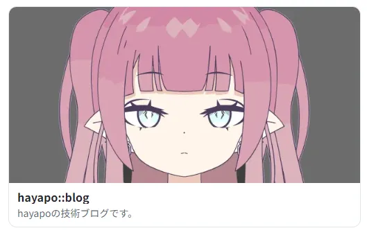
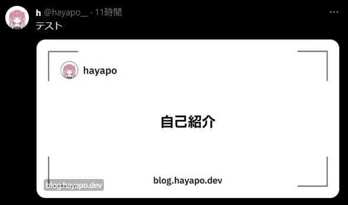

import ExternalLink from "@/components/ExternalLink.astro";

## Twitter cardの仕様変更

2023年10月の初めに、Twitter (別名X)の外部リンクの表示内容が変更されました。

具体的には、`twitter:card`に`summary_large_image`を使用している場合、  
以前は以下の画像のようにOGイメージ＋`description`がカードに表示されていました



しかし仕様変更後は、OGイメージが大きく表示され、以下のように画像の右下にドメインが小さくされるようになりました。


Twitterカードにタイトルとdescriptionが表示されなくなり、
投稿したURLの詳細な情報がわからなくなってしまいました。

最近では、この使用を利用して、OGイメージを画像に見せかけてクリックをさせ、悪質なサイトに飛ばすという例もちらほら見かけます。

ブログ投稿などをOGPの内容が動的に変化するコンテンツを共有する場合には  
OGイメージを自動生成し、記事タイトルをOGイメージに含めたほうが、ユーザーにとって遷移する先のサイト情報がわかりやすくなります。

## OG画像を自動生成する

そこで当ブログも投稿記事をTwitterに共有する際に記事タイトルを含めたOGイメージを動的に生成するようにしました。

概要としては、<ExternalLink href="https://github.com/vercel/satori" title="vercel/satori">vercel/satori</ExternalLink>と<ExternalLink href="https://github.com/yisibl/resvg-js" title="@resvg/resvg-js">@resvg/resvg-js</ExternalLink>を使用して JSX → SVG → PNG の流れでPNGを生成しています

## 実装

### OGイメージのエンドポイントを作成する

まず、`src/pages/og`に`[slug].png.ts`を作り、<cite>画像を返すエンドポイント[^1]</cite>を作成します。
[^1]: <ExternalLink href="https://docs.astro.build/ja/core-concepts/endpoints/" title="endpoint" >Astro endpoint </ExternalLink>

`getStaticPaths()`ですべてのブログエントリの`slug`を取得し、パスを生成します。

次に以下の手順で、`GET関数`で`GET method`に対するレスポンスを定義していきます。  

1. `getStaticPaths()`で生成されたパスからslugを取得し、対応するエントリすべてを`getEntryBySlug()`で取得
2. 後述する`OgImage`コンポーネントでエントリのタイトルをもとにOGイメージを生成する
3. 生成されたOGイメージをbodyとするレスポンスを定義する

```ts
// [slug].png.ts
import type { APIContext } from "astro";
import { getCollection, getEntryBySlug } from "astro:content";
// satoriを使用したOGイメージのコンポーネント
import { OgImage } from "../components/OgImage";

export async function getStaticPaths() {
  const entries = await getCollection("blog");
  return entries.map((entry) => ({
    params: { slug: entry.slug },
  }))
}

export async function GET({ params }: APIContext) {
  const entry = await getEntryBySlug("blog", params.slug as string);
  const body = await OgImage(entry!.data.title); // Bufferを受け取る

  // 生成されたOGイメージを含むレスポンスを返す
  return new Response(body, {
    headers: {
      "Content-Type": "image/png",
    },
  })
}
```

各エントリのパス生成と各エンドポイント（eg: /og/about-me.png）のレスポンス生成はビルド時に行われます

### `satori`でJSXをSVGに変換

次に`satori`を使用してOGイメージをJSXで定義し、SVGに変換します。

`satori`自体の使い方はとても簡単なのでここで詳しく説明しませんが、  
基本的には`satori(element, options)`の第一引数にJSXでOGイメージを定義し、第二引数でフォントや大きさなどを指定してあげればOKです。

### 背景に使用する画像を読み込む

今回はOGイメージの背景に、自作した画像を`astro:assets`を使用して背景画像を読み込んで使用しています

```ts
import ogBackground from "../assets/og_background.png";
```

`satori`では背景画像に画像を使用し、更にSVGやPNGなどにレンダリングする場合は`base64`エンコードされた`Data URL`か`Buffer`を使用すると余計な計算がなくなるらしいので、`src/assets/`においた背景画像を`Data URL`として読み込みます。

このとき、`ogBackground.src`が指すパスが、開発モードとproductionモードで異なる。（developではそのまま`src/assets`以下になるが、productionでは`dist/_astro`以下になる）

そのため、`import.meta.env.DEV`を利用して、モードによって`readFileSync`で指定するパスを変えてあげる

（ここらへんもっと良いいいやり方がありそうなので、知っている方いれば教えて頂きたいです。）

```tsx
const ogBackgroundImage = readFileSync(
    import.meta.env.DEV
      ? new URL(`../assets/og_background.png`, import.meta.url)
      : `./dist/${ogBackground.src}`,
    { encoding: "base64" }
  );

// Data URLにする
const ogBackgroundImageUrl = `data:image/png;base64,${ogBackgroundImage}`;
```

### フォントの取得

satoriで使用する日本語フォントをfetchします。

最初はAstroのドキュメントの通りに、`public/fonts`にfontファイルを置いて利用する方法で行こうとしたのですが、  
satoriが内部で使用している`OpenType`のエラーが出てしまいどうしても解決できなかったのでコード内でfetchするようにしました。

Goolge Fonts APIではURLパラメータの`text=`に渡した文字列に最適化（サブセット化）したフォントファイルを返してくれます。

```tsx
async function getSubsetFontData(text: string, font: string, fontWeight: number) {
  const GOOGLE_FONT_ENDPOINT = `https://fonts.googleapis.com/css2?family=${font}:wght@${fontWeight}&text=${encodeURIComponent(text)}`;

  const css = await fetch(GOOGLE_FONT_ENDPOINT).then((res) => res.text());

  // fontのurlを正規表現で取得する
  const resource = css.match(/src: url\((.+)\) format\('(opentype|truetype)'\)/)?.[1];

  if (!resource) {
    throw new Error('font url is not found');
  }

  const arrayBuffer = await fetch(resource).then((res) => res.arrayBuffer());

  return arrayBuffer;
}
```

    <cite>satori playgroundのソースコード[^2]</cite>でも、同じようにGoolge Fonts APIからフォントをfetchしていますが、  
`.ttf`ファイルを確実に取得するために以下のようにuser agentをすり替えています。  
これはあまりよろしくないな～っていうのと、こんな事しなくても普通にfetchできたので僕の場合はそのままfetchしています。
[^2]: <ExternalLink href="https://github.com/vercel/satori/blob/main/playground/pages/api/font.ts#L86" title="vercel/satori fonts.ts">satori-playgroundの font fetch 実装</ExternalLink>

```ts
// https://github.com/vercel/satori/blob/main/playground/pages/api/font.ts#L86
await fetch(API, {
  headers: {
    // Make sure it returns TTF.
    'User-Agent':
      'Mozilla/5.0 (Macintosh; U; Intel Mac OS X 10_6_8; de-at) AppleWebKit/533.21.1 (KHTML, like Gecko) Version/5.0.5 Safari/533.21.1',
  },
})
```

## 完成

これで、以下のようにブログの各エントリに対してタイトルを挿入したOGイメージを自動生成することができるようになりました



## 参考

1. <ExternalLink href="https://github.com/vercel/satori" title="Github | vercel/satori">vercel
      /satori</ExternalLink>
2. <ExternalLink href="https://t28.dev/blog/output-ogp-image-for-astro-pages/" title="@vercel/og を使って Astro 製ブログのビルド時に OGP 画像を出力する">t28.dev | @vercel/og を使って Astro 製ブログのビルド時に OGP 画像を出力する</ExternalLink>
3. <ExternalLink href="https://blog.lacolaco.net/posts/astro-satori-og-image-generation/" title="Marginalia | satoriを使ったAstroのOGP画像生成メモ">Marginalia | satoriを使ったAstroのOGP画像生成メモ</ExternalLink>
