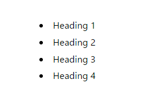

import ExternalLink from "@/components/ExternalLink.astro";

今回、ブログに目次 (Table of Contents) を実装したので、その方法を解説します。

# Headings(見出し)を取得する

本ブログはAstroのContent Collectionsを使用してMDXでブログを執筆しています。

`astro:content`では`Headings`(見出し)が以下のように実装されています。

```ts
// markdown-remark/types.d.ts
export interface MarkdownHeading {
    depth: number;
    slug: string;
    text: string;
}
```

実際にはこの型の配列、つまり`MarkdownHeading[]`として利用することができます。

そして、Contents Collectionsでは、以下の2つの方法で各記事の見出しの一覧を取得することができます。

1. `MarkdownLayoutProps`のプロパティ
2. `CollectionEntry<"YOUR-CONTENT-NAME">`の`render`メソッドの返り値

## MarkdownLayoutPropsでの実装

`astro`パッケージで提供される`MarkdownLayoutProps`もしくは`MDXLayoutProps`を使用することで、見出しの一覧を取得することができます。

`MarkdownLayoutProps`と`MDXLayoutProps`はほぼ同じなので、この記事では`MarkdownLayoutProps`を使用して説明します。

```ts
/* MarkdownLayoutPropsとMDXLayoutPropsの実装 */
export interface MarkdownLayoutProps<T extends Record<string, any>> {
    frontmatter: {
        file: MarkdownInstance<T>['file'];
        url: MarkdownInstance<T>['url'];
    } & T;
    file: MarkdownInstance<T>['file'];
    url: MarkdownInstance<T>['url'];
    headings: MarkdownHeading[];
    /* 以下の２つのプロパティは.mdのみ有効 */
    rawContent: MarkdownInstance<T>['rawContent'];
    compiledContent: MarkdownInstance<T>['compiledContent'];
}

export type MDXLayoutProps<T extends Record<string, any>> = 
  Omit<MarkdownLayoutProps<T>, 'rawContent' | 'compiledContent'>;
```

これを用いて、layoutコンポーネントで見出しの一覧を取得し、簡単な目次を実装できます

型引数`T`には`CollectionEntry<"YOUR-CONTENT-NAME">["data"]`を指定します。

```tsx
// src/layouts/BlankLayout.astro
---
import type { MarkdownLayoutProps } from "astro";
type Props = MarkdownLayoutProps<CollectionEntry<"YOUR-CONTENT-NAME">["data"]>;

const { headings } = Astro.props
---

<ul>
{
  headings.map(({depth, slug, text}) => {
    <li>
      <a href={`#${slug}`}>
        {text}
      </a>
    </li>
  })
}
</ul>

```

これで、このようなMDXの場合

```mdx
---
layouts: root/src/layouts/BlankLayout.astro
---
# Heading 1

## Heading 2

### Heading 3

#### Heading 4
```



このような目次を作成することができました。

## CollectionEntryでの実装
