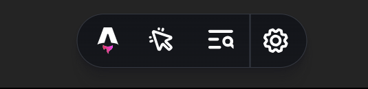
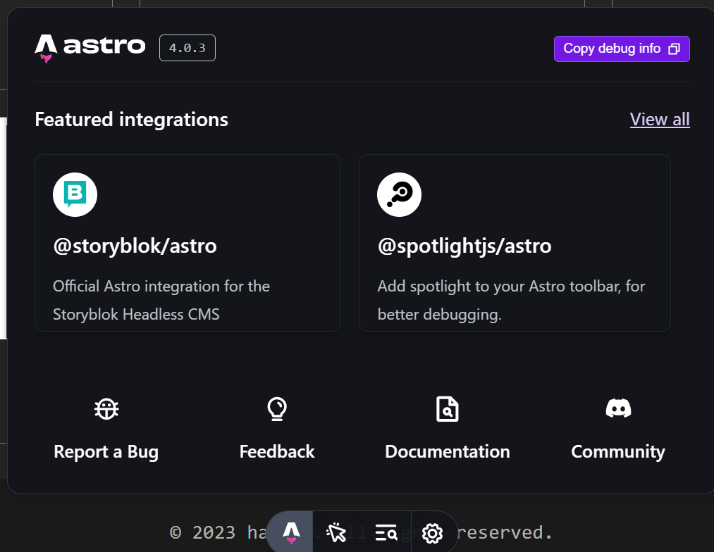
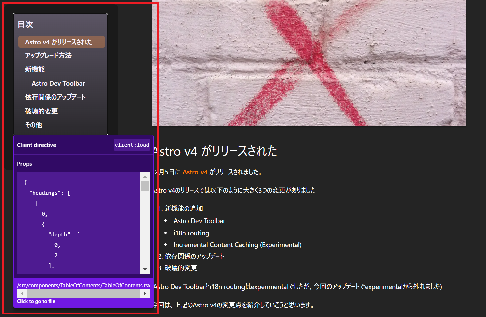

import ExternalLink from "@/components/ExternalLink.astro";

## Astro v4 がリリースされた

12月5日に [Astro v4](https://astro.build/blog/astro-4/) がリリースされました。

Astro v4のリリースでは以下のように大きく3つの変更がありました

1. 新機能の追加
    - Astro Dev Toolbar
    - i18n routing
    - Incremental Content Caching (Experimental)
2. 依存関係のアップデート
3. 破壊的変更

(Astro Dev Toolbarとi18n routingはexperimentalでしたが、今回のアップデートでexperimentalから外れました)

今回は、上記のAstro v4の変更点を紹介していこうと思います。  

また、Astro v4のリリースに伴い、Astro Docもリニューアルされました。  
Astroのドキュメントテンプレートの`Starlight`が使用されており、デザインなどが変更されています。  
私は前のオレンジ色を使ったデザインの方が好きでした...

## アップグレード方法

何はともあれ、まずAstroをアップデートしましょう。  
v4へのアップデートは、以下のコマンドを実行するだけで完了します。

```bash
# npm
npx @astrojs/upgrade

# pnpm
pnpm dlx @astrojs/upgrade

# yarn
yarn dlx @astrojs/upgrade
```

## 新機能

まず初めに、v4で追加された新機能を紹介します。

### Astro Dev Toolbar

Astro Dev Toolbarは、Astroでの開発をより快適にするためのツールです。  
開発サーバーを起動すると自動的に起動し、アクセシビリティやIsland componentのハイライトを行ってくれるツールバーが下部に表示されます。



ツールバーのボタンは左から、以下のような機能を持っています。
1. Menu: Integrationsの紹介やDocmentへのリンク
2. Inpsect: Island componentのハイライト
3. Accessibility: アクセシビリティのチェック
4. Settings: loggingの設定など

#### Menu

Menuボタンでは、Astro公式のIntegrationsの紹介や、Astroのドキュメントへのリンクがあります。



現時点ではあまり機能はありませんが、今後のアップデートで機能が追加される可能性があります。

#### Inspect

Inspectボタンでは、Island architecture のコンポーネントをハイライトしてくれます。

Astroでは基本的にStaticなHTML（No JavascriptなHTML）を生成しレンダリングを行い、インタラクティブにしたいコンポーネントがある場合は、そのコンポーネントのみにJavaScriptを読み込みます。  
このように静的なHTMLの海に、島のようにインタラクティブなコンポーネントが存在することから、Island architectureと呼ばれています。



上の画像の赤線で囲われた部分が、Inspectボタンを押すことで、Islandがハイライトされた部分です。

Islandのディレクティブの種類 (`client:load`, `client:visible`, `client:idle`) が表示され、渡されているpropsやファイルパスも表示されます。

地味に嬉しいのが、このIslandに渡されているpropsが表示されることです。  
インタラクティブなコンポーネントを開発しているときに、現在のpropsを確認できるのはとても嬉しいです。

## 依存関係のアップデート

## 破壊的変更

## その他
